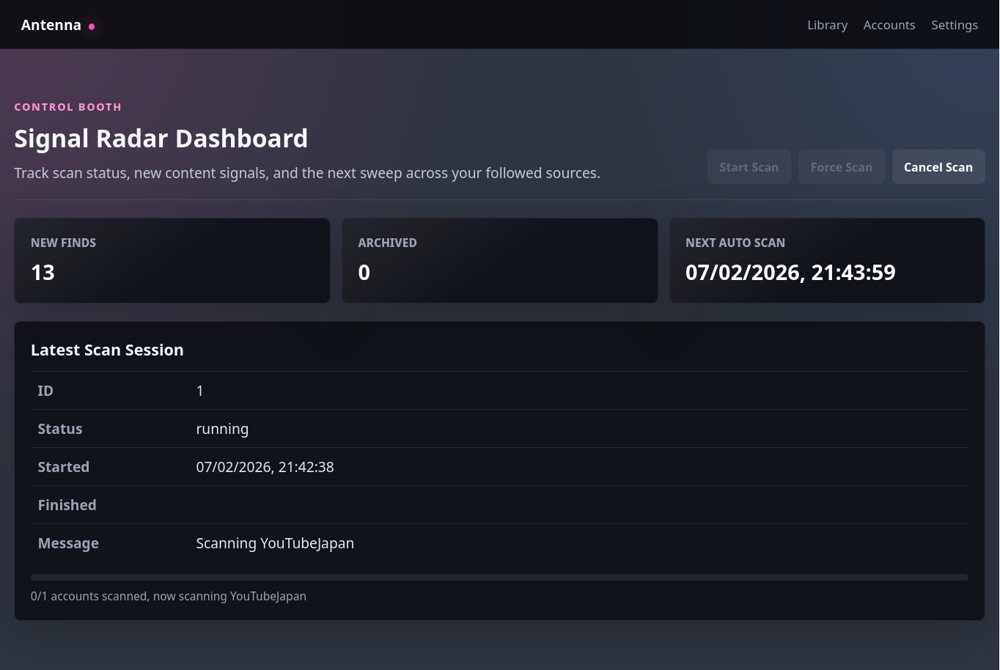
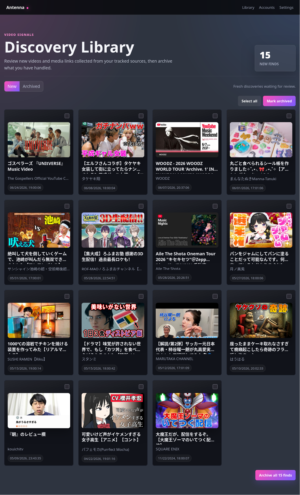
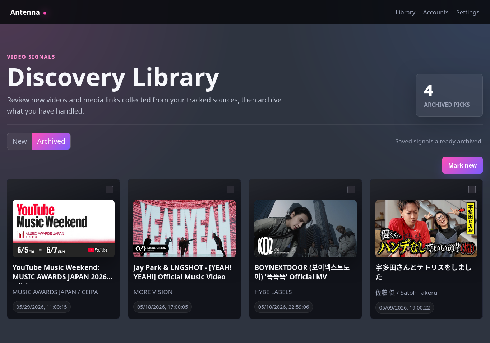
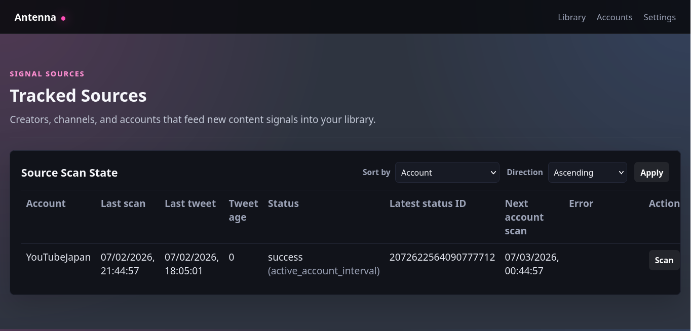

<div align="center">
  <h1>Antenna</h1>
  <p><b>把 X 變成你的專屬影音日報，自動收集 X 上追蹤帳號發佈的 YouTube 連結，打造屬於自己訂閱流</b></p>
</div>

## Screenshots

<table>
  <!-- 第一行 -->
  <tr>
    <td width="50%" align="center" valign="middle">
      
    </td>
    <td width="50%" align="center" valign="middle">
      
    </td>
  </tr>
  <!-- 第二行 -->
  <tr>
    <td width="50%" align="center" valign="middle">
      
    </td>
    <td width="50%" align="center" valign="middle">
      
    </td>
  </tr>
</table>

## Quick Start

```bash
git clone https://github.com/qrsp/antenna
uv sync
```

### Settings

建立本機設定檔：

```bash
cp config.toml.example config.toml
cp .env.example .env
```

主要設定位於 `config.toml`：

- `[lists].follow`：要追蹤的 X/Twitter 帳號清單
- `[scheduler].auto_scan_interval_minutes`：自動掃描檢查間隔
- `[scheduler].minimum_scan_interval_minutes`：同一帳號最短掃描間隔
- `[scheduler].active_account_interval_minutes`：活躍帳號掃描間隔
- `[scheduler].inactive_account_interval_minutes`：非活躍帳號掃描間隔
- `[scheduler].inactive_after_days`：幾天沒有新推文後視為非活躍
- `[scheduler].rate_limit_pause_minutes`：遇到 rate limit 後暫停多久
- `[scheduler].new_account_max_tweets`：新帳號初次掃描最多讀取幾則推文
- `[app].database_url`：SQLite 資料庫位置，預設 `sqlite:///data/antenna.db`
- `[app].thumbnail_dir`：縮圖快取目錄
- `[app].host` / `[app].port`：Web 服務監聽位置

Twitter/X cookies 放在 `.env`：

```env
ANTENNA_TWITTER_COOKIES=''
```

### Start

使用專案入口啟動：

```bash
uv run python -m antenna
```

開發時也可以使用 reload 模式：

```bash
uv run uvicorn antenna.app:create_app --factory --reload
```

啟動後開啟：

```text
http://127.0.0.1:8000
```

## Web Page

- `/`：Dashboard，顯示新影片數、封存影片數、最近掃描與下次掃描時間
- `/accounts`：帳號掃描狀態，可查看每個帳號的最近掃描、最近推文與下次掃描時間
- `/videos?state=new`：新影片 review queue
- `/videos?state=archived`：已封存影片
- `/settings`：目前載入的設定與排程暫停狀態

## API

### Health

```http
GET /api/health
```

回傳服務、資料庫與版本狀態。

### Scans

```http
POST /api/scans
GET /api/scans/latest
GET /api/scans/{scan_id}
```

`POST /api/scans` 可建立掃描任務，request body 範例：

```json
{
  "force": false,
  "limit_accounts": null
}
```

若要只掃描特定帳號：

```json
{
  "force": true,
  "limit_accounts": ["example_user"]
}
```

### Videos

```http
GET /api/videos
GET /api/videos/counts
PATCH /api/videos/{url}/state
PATCH /api/videos/state
```

`GET /api/videos` 支援 query string：

- `state`：`new` 或 `archived`
- `page`：頁碼，預設 `1`
- `per_page`：每頁筆數，預設 `50`，最多 `200`

批次更新影片狀態：

```json
{
  "urls": ["https://www.youtube.com/watch?v=..."],
  "state": "archived"
}
```

## Scan and Schedule

Antenna 啟動後會建立背景自動掃描服務。排程器會根據帳號狀態決定是否掃描：

- 從未掃描過的帳號會優先進入掃描流程
- 活躍帳號使用較短的掃描間隔
- 長時間沒有新推文的帳號會改用較長的掃描間隔
- 如果遇到 X/Twitter rate limit，會暫停掃描一段時間
- 手動強制掃描可以略過一般排程限制

## Development

執行測試：

```bash
uv run pytest
```

執行 lint：

```bash
uv run ruff check .
```

格式化：

```bash
uv run ruff format .
```
